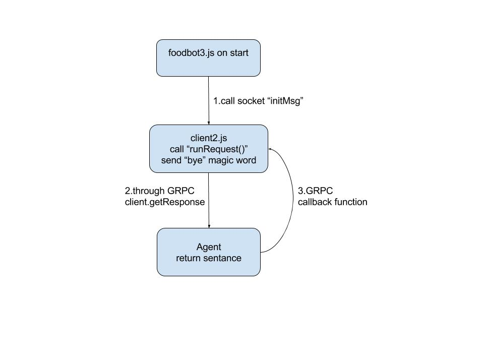
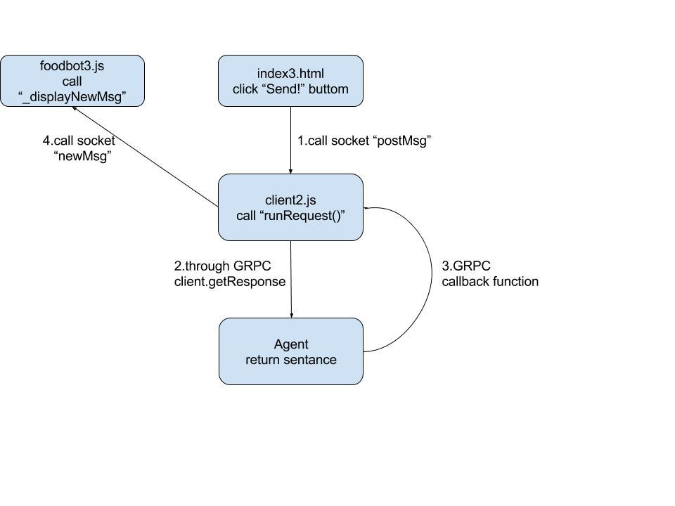
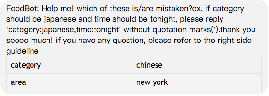

# README
This repo contains code for a chatbot in food domain. [Demo link](http://140.112.49.151:8081/index3.html)

## Functionalities
* **Recommend restaurants** according to requirements, including category, price, area, rating.
* **Provide various info about a certain restaurant**, including address, rating, review, has wifi or not.

## Features
* Support 2 talking styles: gentle & hilarious.
* Support speech API.

## Requirements
* Tensorflow: 0.12.1
`pip install tensorflow==0.12.1`
* Nodejs: [Download](https://nodejs.org/en/download/package-manager/)

## Code Usage
1. Start web server `node client2.js`
2. Brows on borowser `localhost:8081/index3.html`
3. Enjoy

## Implementation
### 1. Ontology
* Data Source: (using the API and crawler)
* Data Size: 1000 restaurants information from New York.
* Number of tables: 3
    * Restaurant Table: (about 1000 rows)
    * Comment Table: (about 300000 rows)
    * Other info of Restaurant Table:(about 1000 rows)

### 2. Language Understanding
### 3. Dialogue Management
* Dialogue State Tracking
    * There are two parts for DST to keep the action which user and agent took.

* DQN Reinforcement Learning
    * DQN is a classification consist of three fully connected layer.
    
* Agent Policy

### 4. Natural Language Generation
(1)NN-based
* An adapted version of a semantically conditioned LSTM: [RNNLG](https://github.com/shawnwun/RNNLG)
* Data collection: sentences with ~10 intents written by human
* Performance: 
    * BLEU score: 0.5518
    * Naturalness: see the example below
    * inform(name = 33 greenwich; address = 7593 kirkland lane rockaway)
    * => “33 greenwich is good good in 7593 kirkland lane rockaway address is in.”

(2)Template-based (using this one!)
* Template: 17 intents, each one with 5~8 templates.

### 5. UI
* Base on nodejs, include: grpc, express, socket, mysql, async
* Workflow:
	* Init: Reset Agent state with magic word "bye" 
	* Basic: in this flow when step.4 return, it include two type paremeter (responseMsg, responseUrl), responseMsg is what agent's answer. And responseUrl have two type of response, one is real url represent image of meme, the other is json obj. in this kind of response, will use other workflow(Show Table). 
	* Show Table:other case of display message 
	
